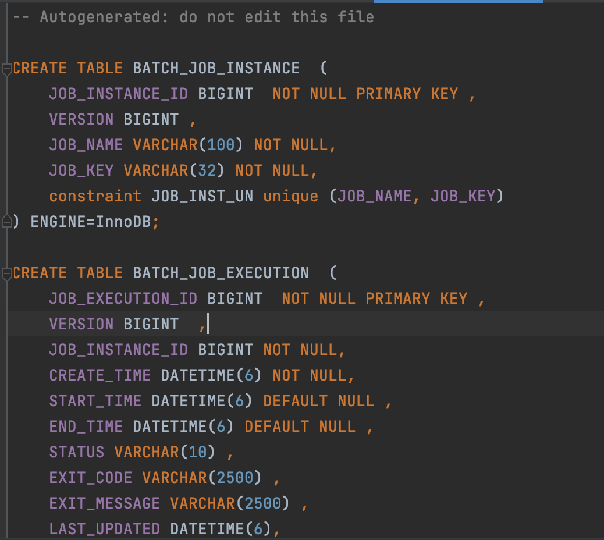

# 01_Spring Batch

**팀원: 김보경, 서병범, 이현재 2023.07.22 (토)**

---

## 1. **Spring Batch: 대용량 데이터 처리의 강력한 도구**

💡 **단발성으로 대용량의 데이터를 처리하는 어플리케이션**</br>
예를 들어, 수백만 개의 레코드를 가진 데이터를 **한꺼번에 처리하거나, 반복적으로 같은 작업을 해야 할 때 유용**한 모듈이다.


> 만약 **매일 전 날의 데이터를 집계**해야 한다면 어디서 어떻게 수행하면 될까?

웹 어플리케이션 밖에 모른다면 Spring MVC 로 구현하게 될 것이다.
하지만 이렇게 **큰 데이터를 읽고, 가공하고, 저장**한다면 해당 서버는 순식간에 서버 자원을 다 사용해서 다른 요청은 처리하지 못하게 될 수 있다.

> 그리고 이 집계 기능을 **하루에 1번만 실행**한다고 하면 이를 위해 API 를 개발하는 건 낭비가 아닐까?
여기서 추가로 데이터가 너무 많아서 **처리 중에 실패가 발생**한다면?
5만번째 데이터에서 실패했다면, **5만 1번째부터 다시 실행**할 수 있다면 얼마나 좋을까?
그리고 오늘 새벽 누군가가 집계 기능을 실행 시켰는데, 다른 누군가가 또 실행시켜 집계 데이터가 2배가 된다면?
같은 파라미터로 같은 기능을 실행할 경우, **이미 실행한 적이 있어 실패하는 기능을 지원**한다면 얼마나 좋을까?
>

위 고민들을 다시 생각해보면 배치 어플리케이션을 구현하기 위해선 비즈니스 로직 외에 부가적으로 신경써야 할 부분들이 많다.

그래서 Spring MVC 패턴과 같이 **비즈니스 로직에 최대한 집중**할 수 있게 지원하는 모듈이 바로 **Spring Batch** 이다.

### 1-1. Spring Batch의 필요성

1. **대용량 데이터 처리:** 일괄 처리(batch processing)는 대량의 데이터를 효율적으로 처리하는 데 최적화되어 있다. 대량의 데이터를 한 번에 처리하는 것은 메모리 사용과 처리 속도에 영향을 미칠 수 있으며, Spring Batch는 이러한 문제를 최소화하는 방법을 제공한다.
2. **오류 복구:** 배치 처리에서는 많은 양의 데이터를 처리하다보면 예상치 못한 오류가 발생할 수 있다. Spring Batch는 오류 처리 및 복구 메커니즘을 제공하여 재시작이나 롤백, 오류 처리 등을 통해 안정적인 배치 처리를 할 수 있다.
3. **정기적인 스케줄링**: Spring Batch는 Cron 또는 Quartz와 같은 스케줄러와 통합하여 정기적인 배치 작업을 스케줄링할 수 있다. 이를 통해 주기적으로 반복되는 작업을 자동화할 수 있다.
4. **통계 및 모니터링**: Spring Batch는 배치 작업의 진행 상태와 통계를 제공하여 모니터링할 수 있다. 이를 통해 배치 작업의 성능과 문제점을 파악하고 최적화할 수 있다.
5. **재사용성과 유지보수성**: Spring Batch는 일련의 단계로 배치 작업을 구성하고, 재사용 가능한 컴포넌트를 제공함으로써 코드의 재사용성과 유지보수성을 향상시킨다.
6. **트랜잭션 관리**: 배치 작업은 여러 단계로 이루어질 수 있으며, 이러한 단계들은 트랜잭션을 통해 관리됩니다. Spring Batch는 이러한 트랜잭션 관리를 지원하여 데이터의 일관성을 유지한다.

### ❓**Spring Batch를 사용하는 것과 cron + service의 설정 차이**

1. **처리 방식**:
    - **Spring Batch:** Spring Batch는 대용량 데이터를 "청크(chunk)" 단위로 처리한다. 이는 데이터를 작은 블록으로 나누어 처리하고, 각 블록을 별도의 트랜잭션으로 처리하여 안정성을 확보한다. 대용량 데이터를 여러 트랜잭션으로 나누어 처리하므로 메모리 사용량을 최적화하면서 오랜 시간동안 실행 가능하다.
    - **Cron + Service 로직**: cron을 설정하여 주기적으로 서비스 로직을 실행하는 경우, 전체 작업이 한 번에 실행될 수 있다. 대용량 데이터를 한 번에 처리하므로 메모리 사용량이 크게 증가할 수 있으며, 오랜 시간이 걸리는 작업이 서버 자원을 차지하여 다른 요청을 처리하지 못할 수 있다.
2. **오류 처리 및 롤백**:
    - **Spring Batch:** Spring Batch는 트랜잭션 범위 내에서 일괄 작업을 수행하므로 오류가 발생하면 해당 트랜잭션을 롤백하고, 다음 트랜잭션에서 이전에 실패한 작업을 다시 실행한다. 이를 통해 데이터의 일관성과 안정성을 유지한다.
    - **Cron + Service 로직**: cron을 통해 주기적으로 실행되는 서비스 로직은 대부분 단일 트랜잭션으로 처리된다. 따라서 일부 데이터 처리가 실패하면 해당 트랜잭션 전체가 롤백되는데, 이는 대용량 데이터를 처리하는 데에 적합하지 않을 수 있다.
3. **복잡성과 확장성**:
    - **Spring Batch**: Spring Batch는 배치 처리에 특화되어 있으며, 대용량 데이터 처리를 위한 다양한 기능과 옵션을 제공한다. 이는 복잡한 배치 작업을 더욱 효과적으로 관리하고 확장할 수 있음을 의미한다.
    - **Cron + Service 로직**: cron을 설정하여 서비스 로직을 주기적으로 실행하는 것은 간단하고 빠르게 구현할 수 있으나, 대용량 데이터 처리와 관련된 고급 기능과 세밀한 제어가 어렵다.
4. **스케줄링과 관리**:
    - **Spring Batch**: Spring Batch는 스케줄러와 통합하여 정기적인 스케줄링을 지원하며, 작업의 상태를 추적하고 관리할 수 있는 강력한 도구들을 제공한다.
    - **Cron + Service 로직**: cron을 사용하여 스케줄링을 구현하는 경우 별도의 관리 및 모니터링 기능이 필요하다.

**결론적으로,** 대용량 데이터 처리와 관련하여 Spring Batch는 안정성, 확장성, 오류 처리, 메모리 최적화 등의 측면에서 우수한 성능을 발휘한다. 반면 cron을 사용한 서비스 로직 실행은 단순하고 빠르게 구현할 수 있지만, 대용량 데이터 처리에 대한 다양한 요구사항을 만족시키기 어려울 수 있다. 따라서 대용량 데이터 처리 작업에는 Spring Batch를 사용하는 것이 더 적합하고 효율적이다.

### 1-2. Batch vs Quartz?

<aside>
📌 - **Spring Batch**는 대용량의 데이터를 일괄 처리하는 데에 특화된 프레임워크
- **Quartz**는 주기적으로 반복되거나 특정 시간에 작업을 실행하도록 할 수 있는 스케줄링 프레임워크

</aside>

⇒ Spring Batch는 스케줄링 기능을 제공하지 않기 때문에, Quartz를 이용하여 Spring Batch 작업을 주기적으로 실행시킬 수 있다.

---

## 2. Spring Batch 구조


<aside>
📌 Spring Batch는 Job time에 Bean이 생성되면 JobLauncher 객체에 의해서 Job을 수행한다.

따라서, **JobLauncher --(실행) → Job --(실행) → Step** 구조가 된다.

참고) [https://rok93.tistory.com/entry/Spring-Batch-구조](https://rok93.tistory.com/entry/Spring-Batch-%EA%B5%AC%EC%A1%B0)

</aside>

1. **JobLauncher**: Job을 실행하는 역할을 담당한다. Spring Batch의 Job은 JobLauncher를 통해 실행되며, JobExecution 객체를 반환하여 Job 실행 상태를 확인할 수 있다.
2. **Job**: 배치 처리의 최상위 개념으로 하나의 Job은 하나의 배치 처리 작업을 나타낸다. Job은 여러 개의 Step으로 구성되며, 하나의 Job은 하나 이상의 배치 작업을 수행한다.
3. **Step**: Job을 구성하는 하위 단위로서 하나의 Step은 하나의 작업 단위를 의미한다. 각 Step은 하나의 Chunk로 분할되어 처리되며, Chunk는 하나의 트랜잭션 내에서 처리된다.
4. **ItemReader**: 데이터 소스에서 데이터를 읽어오는 역할을 담당한다. 데이터베이스, 파일, 메시지 큐 등 다양한 소스로부터 데이터를 읽어올 수 있다.
5. **ItemProcessor**: ItemReader에서 읽어온 데이터를 가공하고 필터링하는 역할을 담당한다. 필요에 따라 데이터 변환이나 유효성 검사 등을 수행한다.
6. **ItemWriter**: ItemProcessor에서 가공된 데이터를 저장하는 역할을 담당한다. 데이터베이스에 저장하거나 파일로 출력하는 등 다양한 저장소에 데이터를 저장할 수 있다.
7. **JobRepository**: Job의 실행 상태를 관리하고, 실행 결과를 저장하는 역할을 담당한다. JobExecution의 상태와 실행 결과는 JobRepository에 저장되어 추후 조회할 수 있다.

### 2-1. Chunk와 Tasklet


|      | Chunk                                                                                                                                                                                                      | Tasklet                                                                                                                                   |
|------|------------------------------------------------------------------------------------------------------------------------------------------------------------------------------------------------------------|-------------------------------------------------------------------------------------------------------------------------------------------|
| 처리방식 | 💠 대용량 데이터를 묶어서 한 번에 처리하는 방식</br>💠 데이터를 지정된 Chunk 크기만큼 읽어와서 ItemProcessor와 ItemWriter에 전달 ⇒ 이후 다음 Chunk를 읽어오는 방식으로 처리</br>💠 Chunk 기반의 Step은 트랜잭션 관리가 내장되어 있어서 실패 시 롤백이 가능하며, 트랜잭션 범위 안에서 안정적인 데이터 처리를 보장 | 💠 하나의 태스크를 단위로 처리하는 방식</br>💠 ItemReader와 ItemWriter를 사용하지 않고, 사용자가 직접 Step의 수행 로직을 구현하는 방식</br>💠 하나의 태스크가 성공적으로 완료되면, Step은 다음 태스크를 실행 |
| 장점   | 💠 대용량 데이터 처리에 효과적 ⇒ 큰 메모리를 필요로 하지 않아 OutOfMemoryError를 방지할 수 있음</br>💠 실패 시 롤백이 가능하여 데이터 일관성을 유지할 수 있음 ⇒ 실패 시 해당 chunk만 재시도하고, 성공한 chunk는 건너뛰어 다음 chunk를 처리함                                              | 💠 자유로운 로직 구현이 가능하며, 복잡한 비즈니스 로직을 처리할 수 있음</br>💠 Chunk보다 더 세밀한 컨트롤이 가능                                                                   |
| 단점   | 💠 Chunk 크기를 설정해야 하므로, 적절한 Chunk 크기를 설정하는 것이 중요</br>💠 각 Chunk 사이에 트랜잭션 커밋이 발생하므로, 일부 Chunk의 작업이 실패하더라도 전체 작업이 롤백되지 않을 수 있음                                                                                | 💠 대용량 데이터 처리에는 적합하지 않을 수 있음</br>💠 실패 시 롤백을 개발자가 직접 구현해야 함                                                                               |

- **예시코드**

    ```java
    @Configuration
    @EnableBatchProcessing
    public class TaskletExampleJobConfig {
    	
    		@Autowired
    		private JobBuilderFactory jobBuilderFactory;
    		
    		@Autowired
    		private StepBuilderFactory stepBuilderFactory;
    		
    		@Autowired
    		private DataSource dataSource;
    		
    		@Bean
    		public Tasklet myTasklet() {
    		    return new MyTasklet();
    		}
    		
    		@Bean
    		public Step taskletStep() {
    		    return stepBuilderFactory.get("taskletStep")
    		        .tasklet(myTasklet())
    		        .build();
    		}
    		
    		@Bean
    		public Job taskletExampleJob() {
    		    return jobBuilderFactory.get("taskletExampleJob")
    		        .incrementer(new RunIdIncrementer())
    		        .flow(taskletStep())
    		        .end()
    		        .build();
    		}
    
    }
    ```

    ```java
    @Configuration
    @EnableBatchProcessing
    public class ChunkExampleJobConfig {
    
    		@Autowired
    		private JobBuilderFactory jobBuilderFactory;
    		
    		@Autowired
    		private StepBuilderFactory stepBuilderFactory;
    		
    		@Autowired
    		private DataSource dataSource;
    		
    		@Bean
    		public ItemReader<String> itemReader() {
    		    // 데이터를 읽어오는 ItemReader 구현
    		    return new MyItemReader();
    		}
    		
    		@Bean
    		public ItemProcessor<String, String> itemProcessor() {
    		    // 데이터를 가공하는 ItemProcessor 구현
    		    return new MyItemProcessor();
    		}
    		
    		@Bean
    		public ItemWriter<String> itemWriter() {
    		    // 데이터를 저장하는 ItemWriter 구현
    		    return new MyItemWriter();
    		}
    		
    		@Bean
    		public Step chunkStep() {
    		    return stepBuilderFactory.get("chunkStep")
    		        .<String, String>chunk(100) // Chunk 크기 설정
    		        .reader(itemReader())
    		        .processor(itemProcessor())
    		        .writer(itemWriter())
    		        .build();
    		}
    		
    		@Bean
    		public Job chunkExampleJob() {
    		    return jobBuilderFactory.get("chunkExampleJob")
    		        .incrementer(new RunIdIncrementer())
    		        .flow(chunkStep())
    		        .end()
    		        .build();
    		}
    
    }
    ```


### ❓Tasklet 방식보다 Chunk 방식을 더 선호하는 이유

|            | Chunk                                                                   | Tasklet                                                                                   |
|------------|-------------------------------------------------------------------------|-------------------------------------------------------------------------------------------|
| 대용량 데이터 처리 | 💠 큰 데이터를 작은 청크로 나누어 처리하므로 메모리 사용량을 효율적으로 관리 가능                         | 💠 한 번에 하나의 작업만을 처리 ⇒ 대용량 데이터를 작은 단위로 쪼개어 처리하는 것은 개발자에게 많은 추가 작업과 관리 부담을 주게 됨             |
| 트랜잭션 관리    | 💠 청크 단위로 트랜잭션을 관리 ⇒ 하나의 청크가 실패하더라도 롤백 가능                               | 💠 개발자가 직접 트랜잭션을 관리해야 함 ⇒ 한 번에 하나의 작업만을 처리 하는 경우, 하나의 작업이 실패하면 이를 롤백, 재실행 등의 트랜잭션 관리가 어려움 |
| 병렬         |                                                                         |                                                                                           |
| 처리         | 💠 각 청크는 독립적으로 실행되므로, 여러 쓰레드 또는 서버에서 동시에 여러 청크를 병렬로 처리할 수 있음 ⇒ 처리 속도 향상 | 💠 한 번에 하나의 작업만을 처리하므로 병렬처리가 어려움 ⇒ Tasklet방식은 이를 지원하지 않음                                  |
| 재시작        | 💠 청크 내에서 실패한 작업을 다시 실행하는 것이 가능 ⇒ 이로 인해 중단된 작업을 다시 시작할 수 있음             | 💠 작업이 실패하면 처음부터 다시 시작해야 함                                                                |
| 스프링 배치의 기능 | 💠 Chunk 방식은 스프링 배치가 기본적으로 지원하는 방식으로 많은 기능을 제공                          | 💠 Tasklet 방식은 비교적 기본적인 기능만을 제공하며, 스프링 배치가 제공하는 다양한 기능들을 활용할 수 없음                         |

---

## 3. 메타테이블


💡 **배치 작업의 실행 상태와 관련된 정보를 저장하는 테이블을 말한다.**
</br>메타테이블은 스프링 배치의 기본적인 데이터베이스 스키마에 포함되어 있으며, 배치 작업의 관리와 모니터링을 위해 사용된다.
**이 테이블들이 있어야만 Spring Batch 가 정상 작동하며,** 기본적으로 H2 DB 를 사용할 경우엔 해당 테이블을 Spring Boot 가 자동으로 생성해주지만, **그 외 DB 를 사용할 땐 직접 생성**해야 한다.

1. **BATCH_JOB_INSTANCE:** 배치 작업의 인스턴스 정보를 저장하는 테이블
    1.  배치 작업의 실행에 대한 메타데이터를 관리
    2. 동일한 Job을 여러 번 실행할 경우 각각의 실행을 구분하기 위해 Job 파라미터 등이 저장
2. **BATCH_JOB_EXECUTION:** 배치 작업의 실행 정보를 저장하는 테이블
    1. 실제로 실행된 배치 작업에 대한 정보를 기록
    2. 작업의 시작 시간, 종료 시간, 상태 등이 포함
3. **BATCH_STEP_EXECUTION:** 각 Step의 실행 정보를 저장하는 테이블
    1.  Step의 시작 시간, 종료 시간, 상태 등이 포함
4. **BATCH_JOB_EXECUTION_PARAMS:** 배치 작업의 실행 파라미터를 저장하는 테이블
    1. 실행에 필요한 파라미터 정보를 기록
5. **BATCH_JOB_EXECUTION_CONTEXT:** JobExecution의 ExecutionContext 정보를 저장하는 테이블
    1. Job Instance 가 실패 시 중단된 위치에서 다시 시작할 수 있는 정보를 기록
6. **BATCH_STEP_EXECUTION_CONTEXT:** StepExecution의 ExecutionContext 정보를 저장하는 테이블
    1. '단계 인스턴스'가 실패 시 중단된 정확한 위치에서 재개할 수 있도록 각 단계 실행에 특정한 관련 컨텍스트 정보를 기록
    2. 이 테이블의 ExecutionContext 정보를 사용하여 실패 시점부터 단계를 다시 실행하여 처리된 데이터가 다시 처리되지 않도록 함.

---

## 4. Job과 Step Execution

1. **Job Execution:**
    - JOB Execution은 하나의 배치 작업(또는 배치 프로세스)을 실행하는 단위이다. JOB Execution은 JobInstance의 실행을 나타내며, 여러 번 실행될 수 있다.
        - 예를 들어, 일일 배치 작업이 JOB Execution으로 실행될 때, 매일 새로운 JOB Execution이 생성될 것이다.
        - JOB Execution은 배치 작업의 실행 상태와 실행 결과를 추적한다. JobExecution 객체는 배치 작업의 ID, 시작 시간, 종료 시간, 실행 상태(성공, 실패 등), ExitStatus(완료 상태에 대한 추가 정보) 등을 가지고 있다.
    - JOB Execution은 이전 실행과 관련된 정보(성공한 JOB Execution의 마지막 실행 시간 등)을 유지하는데 도움이 된다.
        - 이를 통해 배치 작업의 이력과 통계를 추적하고, 실패한 작업의 원인을 파악하는 데 도움이 된다.
2. **Step Execution:**
- STEP Execution은 JOB Execution 내에서 실행되는 각각의 Step의 실행을 나타낸다. 한 개의 JOB Execution에 여러 개의 STEP Execution이 포함될 수 있다.
    - 예를 들어, 일일 배치 작업(JobExecution)은 데이터를 읽는 Step, 가공하는 Step, 저장하는 Step 등으로 구성될 수 있으며, 각각의 Step은 STEP Execution으로 실행된다.
- STEP Execution은 각 Step의 실행 상태와 결과를 추적한다. StepExecution 객체는 Step의 ID, 시작 시간, 종료 시간, 실행 상태(성공, 실패 등), ExitStatus(완료 상태에 대한 추가 정보) 등을 가지고 있다.
- STEP Execution은 JOB Execution과 마찬가지로 이전 실행과 관련된 정보를 유지하는데 도움이 된다. 각 Step의 실행 결과와 실행 상태를 추적하여 해당 Step이 정상적으로 실행되었는지, 실패했는지 등을 파악할 수 있다.

Job과 Step Execution은 JobLauncher와 StepExecutor를 통해 시작되며, 실행 상태와 결과를 JobRepository에 저장하여 추적하고 관리한다.

**⇒ 이들은 배치 작업의 실행과 관리를 위해 사용되는 핵심적인 개념들이다.**

- **`@AfterStep`** 어노테이션을 사용하여 Step이 완료된 후 실행되는 메서드를 보여주는 예제 코드

```java
@Bean
public Step myStep() {
		return stepBuilderFactory.get("myStep")
						.<Person, Person>chunk(10)
						.reader(reader())
						.processor(processor())
						.writer(writer())
						.listener(myStepListener()) // Step 리스너 등록
						.build();
}
```

```java

@Component
public class MyStepListener {

@AfterStep
public ExitStatus afterStep(StepExecution stepExecution) {
    // Step이 완료된 후 실행되는 메서드
	
	    String filePath = stepExecution.getJobExecution().getJobParameters().getString("filePath");
	    System.out.println("Step completed for file: " + filePath);
	
	    if (stepExecution.getStatus() == BatchStatus.FAILED) {
	        // Step이 실패한 경우
	        stepExecution.setStatus(BatchStatus.FAILED);
	        stepExecution.getJobExecution().setStatus(BatchStatus.FAILED);
	        stepExecution.getJobExecution().setExitStatus(ExitStatus.FAILED.addExitDescription("Flat file parse exception occurred"));
	
	        // TaskReq 업데이트 등의 추가 로직 수행
	        TaskReq taskReq = taskReqRepository.findByTaskReqFilePath(filePath);
	        taskReqRepository.updateTaskStatusAndEndTime(TaskStatus.ERROR.name(), LocalDateTime.now(), taskReq.getTaskReqId());
	    }
	
	    if (stepExecution.getStatus() == BatchStatus.COMPLETED) {
	        // Step이 성공적으로 완료된 경우
	        TaskReq taskReq = taskReqRepository.findByTaskReqFilePath(filePath);
	        taskReqRepository.updateTaskStatusAndEndTime(TaskStatus.COMPLETED.name(), LocalDateTime.now(), taskReq.getTaskReqId());
	    }
	
	    return ExitStatus.COMPLETED;
	}
}

```

- 코드 설명
    1. **`afterStep`** 메서드가 **`@AfterStep`** 어노테이션에 의해 Step이 완료된 후 실행되는 메서드이다.
    2. **`stepExecution.getJobExecution().getJobParameters().getString("filePath")`**를 사용하여 Step의 JobParameters에서 "filePath"라는 이름의 파라미터 값을 가져온다. 이 파라미터는 Job 실행 시 전달되는 파라미터 중 하나로, Step이 실행될 때 해당 값이 전달되었을 것이다.
    3. "filePath" 변수에 저장된 파일 경로를 출력한다. 이렇게 하면 Step이 완료된 후, 해당 Step이 어떤 파일을 처리했는지를 확인할 수 있다.
    4. Step의 실행 상태를 확인한다. **`stepExecution.getStatus()`**를 사용하여 Step의 상태를 가져올 수 있다.
    5. Step의 상태가 **`BatchStatus.FAILED`**인 경우, 즉 Step이 실패한 경우 추가 로직을 수행한다.
    6. Step의 상태를 **`BatchStatus.FAILED`**로 설정하고, Step이 속한 Job의 상태도 **`BatchStatus.FAILED`**로 설정한다. 이렇게 하면 Job이 실패한 상태로 마무리된다.
    7. **`ExitStatus.FAILED.addExitDescription("Flat file parse exception occurred")`**를 사용하여 Step의 ExitStatus를 업데이트한다. 이렇게 하면 해당 Step이 완료된 후에 Job의 ExitStatus에 추가적인 정보가 포함되게 된다.
    8. **`taskReqRepository`**를 사용하여 파일 경로를 사용하여 해당 TaskReq를 조회하고, Task의 상태와 종료 시간을 업데이트한다. 이러한 추가 로직은 실패한 Step에 대해 후속 조치를 취하는 등의 작업에 사용될 수 있다.
    9. Step의 상태가 **`BatchStatus.COMPLETED`**인 경우, 즉 Step이 성공적으로 완료된 경우, 마찬가지로 **`taskReqRepository`**를 사용하여 해당 TaskReq를 조회하고, Task의 상태와 종료 시간을 업데이트한다. 이렇게 하면 성공적으로 완료된 Task에 대한 정보도 업데이트할 수 있다.
    10. **`ExitStatus.COMPLETED`**를 반환하여 Step의 ExitStatus를 완료 상태로 설정한다.

---

## 5. Flow와 Scope

<aside>
💡 Flow와 Scope는 배치 작업의 흐름 관리와 데이터 공유를 위해 사용되는 기능이다.

</aside>

1. **Flow**
   Flow는 배치 작업을 여러 단계로 나누고, 각 단계의 실행 흐름을 결정하는 역할을 한다.

   보통 Flow는 Job 안에 포함되며, Step들을 순서대로 연결하여 실행 순서를 지정한다.


**< 특 징 >**


- Flow는 하나 이상의 Step으로 구성된다.
- 각 Step은 성공적으로 완료된 경우에 다음 Step으로 진행한다.
- Step 간에 실패 시, 원하는 Step으로 이동하거나 처리를 중단할 수 있다.
- 조건에 따라 다른 Step으로 분기하는 로직을 정의할 수 있다.

- **예제 코드**

    ```java
    @Slf4j
    @Configuration
    @RequiredArgsConstructor
    public class FlowStepBatchJob {
        private final JobBuilderFactory jobBuilderFactory;
        private final StepBuilderFactory stepBuilderFactory;
    
        @Bean
        public Job ExampleJob(){
            return jobBuilderFactory.get("flowStepJob")
                    .start(startStep())
                        .on("FAILED")          // startStep 의 상태가 FAILED 인 경우
                        .to(failOverStep())    // failOverStep() Step 실행
                        .on("*")               // failOverStep의 상태 관계 없이 모두
                        .end()                 // step 종료
    
                    .from(startStep())         // startStep 으로 부터
                        .on("COMPLETED")       // startStep 의 상태가 COMPLETED 인 경우
                        .to(successOverStep()) // successOverStep() Step 실행
                        .next(finishOverStep())// successOverStep 다음 실행
                        .on("*")               // successOverStep 의 상태 관계 없이 모두
                        .end()                 // Step 종료
    
                    .from(startStep())         // startStep 으로 부터
                        .on("*")               // startStep 의 상태 관계 없이 모두
                        .to(allOverStep())     // allOverStep() Step 실행
                        .on("*")               // allOverStep 의 상태 관게 없이 모두
                        .end()		   // Step 종료
                    .end()                     // Job 종료
                    .build();
        }
    
        @Bean
        public Step startStep() {
            return stepBuilderFactory.get("startStep")
                    .tasklet((contribution, chunkContext) -> {
                        log.info("FlowStepJob Start Step!");
    
                        /**
                         * ExitStatus 를 FAILED 로 지정하여 테스트
                         * 정상 Step 테스트 위해서는 ExitStatus.COMPLETED 로 변경
                         * 기본적으로 미선언시 COMPLETED 이므로, 필요 테스트 시 UNKNOWN 같은 타입으로 테스트
                         */
                        //contribution.setExitStatus(ExitStatus.FAILED);
                        //contribution.setExitStatus(ExitStatus.COMPLETED);
                        contribution.setExitStatus(ExitStatus.UNKNOWN);
    
                        return RepeatStatus.FINISHED;
                    })
                    .build();
        }
    
        @Bean
        public Step failOverStep(){
            return stepBuilderFactory.get("failOverStep")
                    .tasklet((contribution, chunkContext) -> {
                        log.info("FlowStepJob FailOver Step! -> startStep 이 FAILED 이면 실행됌");
                        return RepeatStatus.FINISHED;
                    })
                    .build();
        }
    
        @Bean
        public Step successOverStep(){
            return stepBuilderFactory.get("successOverStep")
                    .tasklet((contribution, chunkContext) -> {
                        log.info("FlowStepJob successOverStep Step! -> startStep 이 COMPLETED 이면 실행됌");
                        return RepeatStatus.FINISHED;
                    })
                    .build();
        }
    
        @Bean
        public Step finishOverStep(){
            return stepBuilderFactory.get("finishOverStep")
                    .tasklet((contribution, chunkContext) -> {
                        log.info("FlowStepJob finishOverStep Step! -> successOverStep 이후 실행됌");
                        return RepeatStatus.FINISHED;
                    })
                    .build();
        }
    
        @Bean
        public Step allOverStep(){
            return stepBuilderFactory.get("allOverStep")
                    .tasklet((contribution, chunkContext) -> {
                        log.info("FlowStepJob allOverStep Step! -> startStep 상태 상관 없이 실행됌");
                        return RepeatStatus.FINISHED;
                    })
                    .build();
        }
    }
    ```


- .on
    - ()Step의 ExitStatus 상태를 캐치할 상태 입력
    - * 인 경우 모든 상태이고, 이외에는 "FAILED", "COMPLETED" 와 같이 입력
- .to()
    - 다음으로 이동할 Step 작성
- .from()
    - 일종의 이벤트 리스너 역할
    - 상태값을 보고 일치하는 상태라면 to() 에 포함된 step 을 호출
    - 예를들어, startStep 의 이벤트 캐치가 FAILED 로 되있는 상태에서 추가로 이벤트 캐치를 하고자 하면 from 을 사용해야 함.
- .end()
    - FlowBuilder 를 반환하는 end 와 FlowBuild 를 종료하는 end 2가지 종류가 존재
        - on("*") 뒤에 있는 end 는 FlowBuilder 를 반환하는 end
        - build() 앞에 있는 end 는 FlowBuilder 를 종료하는 end
1. **Scope**

   Scope는 Step 내에서 데이터를 공유하거나 유지하는 방법을 정의한다.

   Spring Batch에서는 다양한 Scope를 제공하며, 주로 Step 내에서 데이터를 공유하는 데 사용된다.  Scope는 Step의 실행 시점과 Step 안에서의 데이터 유지 기간을 결정한다.


**< 특 징 >**

- Step Scope: Step 실행 도중에만 데이터를 유지하며, Step 간에는 공유되지 않는다.
- Job Scope: Job 실행 동안 데이터를 유지하며, 모든 Step에서 공유된다.
- JobExecution Scope: JobExecution 객체 수준에서 데이터를 유지하며, Job의 모든 Step에서 공유된다.

```java
@Bean
@StepScope
public Tasklet myTasklet(@Value("#{jobParameters['param']}") String param) {
		return (contribution, chunkContext) -> {
		// Step 내에서 param 값을 사용하여 처리
		System.out.println("Param: " + param);
		return RepeatStatus.FINISHED;
		};
}
```

⇒ `@StepScope`를 사용하여 Step Scope로 설정한 `myTasklet`에서 Step 실행 도중에만 `param` 값을 사용할 수 있다.

⇒ `@Value("#{jobParameters['param']}")`는 JobParameters에서 'param' 값을 가져오는 방법이다.

참고) [https://dev-jwblog.tistory.com/132](https://dev-jwblog.tistory.com/132)

---

## 6. 어노테이션

1. **@EnableBatchProcessing:** Spring Batch를 사용하기 위해 설정 클래스에 추가하여, Batch 관련 구성을 활성화
2. **@JobScope:** Job 실행 도중에만 빈의 인스턴스를 생성하도록 지정하는 스코프 어노테이션으로, Job 파라미터를 사용하여 빈을 초기화할 때 유용하게 사용
3. **@StepScope:** Step 실행 도중에만 빈의 인스턴스를 생성하도록 지정하는 스코프 어노테이션으로,  Step 파라미터를 사용하여 빈을 초기화할 때 유용하게 사용
4. **@Step**: Step 구성을 정의할 때 사용되는 어노테이션으로, Step 실행과 관련된 설정을 지정
5. **@Job**: Job 구성을 정의할 때 사용되는 어노테이션으로, Job 실행과 관련된 설정을 지정
6. **@BeforeStep**: Step 실행 전에 호출되는 메서드에 적용하여 초기화 또는 설정을 수행
7. **@AfterStep**: Step 실행 후에 호출되는 메서드에 적용하여 마무리 작업을 수행
8. **@BeforeJob**: Job 실행 전에 호출되는 메서드에 적용하여 초기화 또는 설정을 수행
9. **@AfterJob**: Job 실행 후에 호출되는 메서드에 적용하여 마무리 작업을 수행
10. **@StepListener:** Step 리스너를 구현할 때 사용되는 어노테이션으로, Step 실행 전후의 이벤트를 처리
11. **@JobListener:** Job 리스너를 구현할 때 사용되는 어노테이션으로, Job 실행 전후의 이벤트를 처리

---

## 7. 구 현

### 7-1. 프로젝트 생성하기

- IDE : Intelli J 2022.02
- SpringBoot : 2.7.3
- java : JDK 11
- DB : MySQL

### **🔷 1) 의존성 추가하기**


⇒ 필요한 dependencies 추가

### **🔷 2)  MySQL 환경 구성하기**

- Spring Batch 를 사용하기 위해서는 DB 를 통해 Meta Data Table 이 생성되어야만 한다.
- 기본적으로 H2 DB 를 사용하는 경우에는 해당 테이블들을 Spring Boot 가 프로젝트 실행 시에 자동으로 생성해주지만, **MySQL 이나 Oracle 과 같은 DB 를 사용할 때는 생성해주지 않아 개발자가 직접 생성**해야만 한다.
- 해당 테이블의 정보는 Spring Batch Dependency 에 스키마가 존재하여, 이를 복사하여 그대로 CREATE 하면 된다. (여기서는 schema-mysql.sql 을 사용)




- **완성된 테이블 예시**


### **🔷 3) src/main/resources/application.yaml 설정**

```java
server:
  port: 8080

spring:
  profiles:
    active: mysql
---
spring:
  config:
    activate:
      on-profile: mysql
  datasource:
    hikari:
      driver-class-name: com.mysql.cj.jdbc.Driver
      jdbc-url: jdbc:mysql://localhost:3306/스키마명?useSSL=false&allowPublicKeyRetrieval=true&useUnicode=true&characterEncoding=utf8&Timezone=Asia/Seoul
      username: 유저네임
      password: 패스워드

  jpa:
    hibernate:
      ddl-auto: update
    properties:
      hibernate:
        format_sql: true
    show-sql: true

  output:
    ansi:
      enabled: always
```

### **🔷 4) SpringbatchApplication.java

- SpringBatch 기능을 활성화가 필요하기에 **@EnableBatchProcessing 어노테이션을 추가**


---

### 7-2. Job, Step  구성

```java
@Slf4j // log 사용을 위한 lombok 어노테이션
@RequiredArgsConstructor // 생성자 DI를 위한 lombok 어노테이션
@Configuration
public class SimpleJobConfiguration {
    private final JobBuilderFactory jobBuilderFactory; // 생성자 DI 받음
    private final StepBuilderFactory stepBuilderFactory; // 생성자 DI 받음

    @Bean
    public Job simpleJob() {
        return jobBuilderFactory.get("simpleJob")
                .start(simpleStep1())
                .build();
    }

    @Bean
    public Step simpleStep1() {
        return stepBuilderFactory.get("simpleStep1")
                .tasklet((contribution, chunkContext) -> {
                    log.info(">>>>> This is Step1");
                    return RepeatStatus.FINISHED;
                })
                .build();
    }
}
```

- SimpleJobConfiguration 객체는 JobLauncher 객체
- Spring Batch 의 **모든 Job 은 @Configuration 으로 등록해서 사용**
- jobBuilderFactory.get(”simpleJob”)
    - “simpleJob” 이란 이름의 Batch Job 을 생성
    - Job 의 이름은 별도로 지정하지 않고, 이렇게 Builder 를 통해 지정
- stepBuilderFactory.get(”simpleStep1”)
    - “simpleStep1” 이란 이름의 Batch Step 을 생성
    - Job 과 마찬가지로 Builder 를 통해 이름을 지정
- .tasklet((contribution, chunkContext))
    - step 안에서 수행될 기능들을 명시
    - Tasklet 은 **Step 안에서 단일로 수행될 커스텀한 기능**들을 선언할 때 사용

---

### 7-3. JobParameter

<aside>
💡 JobParameter는 배치 작업 실행 시에 파라미터 값을 전달하는 데 사용되는 매개변수

</aside>

1. **동적인 실행 제어**: 배치 작업을 실행할 때 특정 파라미터 값을 변경하여 다른 결과를 얻을 수 있다. 예를 들어, 파일 이름이나 날짜를 파라미터로 전달하여 매번 다른 파일을 처리하거나, 특정 기간의 데이터를 집계하는 등의 작업을 수행할 수 있다.
2. **재사용성**: 동일한 배치 Job을 다양한 파라미터 값으로 여러 번 실행하여 반복 작업을 수행할 수 있다. 이를 통해 일관성 있게 여러 작업을 실행하거나, 일정 주기로 반복 작업을 수행할 수 있다.
3. **외부에서의 제어**: JobParameter는 배치 작업 실행 시 외부에서 전달되기 때문에, 배치 Job을 실행하는 방법과 파라미터 값을 변경하는 작업이 분리된다. 이는 배치 작업을 스케줄링 시스템이나 외부 어플리케이션으로부터 제어하는 데에 유용하다.

- 특정 날짜를 Job Parameter 로 받으면 해당 날짜 데이터로 Job 을 성공적으로 수행하고 **다시 같은 Job Parameter 를 받게 되면 Job 은 수행되지 않는다.**

```java
@Slf4j // log 사용을 위한 lombok 어노테이션
@RequiredArgsConstructor // 생성자 DI를 위한 lombok 어노테이션
@Configuration
public class SimpleJobConfiguration {
    private final JobBuilderFactory jobBuilderFactory; // 생성자 DI 받음
    private final StepBuilderFactory stepBuilderFactory; // 생성자 DI 받음

    @Bean
    public Job simpleJob() {
        return jobBuilderFactory.get("simpleJob")
                .start(simpleStep1(null)) // null 값 전달
                .build();
    }

    @Bean
		@JobScope // JobParameter 사용 시 필수
    public Step simpleStep1(@Value("#{jobParameters[requestDate]}") String requestDate) {
        return stepBuilderFactory.get("simpleStep1")
                .tasklet((contribution, chunkContext) -> {
                    log.info(">>>>> This is Step1");
										log.info(">>>>> requestDate = {}", requestDate);
                    return RepeatStatus.FINISHED;
                })
                .build();
    }
}
```

- @JobScope 는 필수!
- 여기서 JobParameter 를 아래와 같이 실행 환경에서 **Program Arguments** 에 입력하여 실행해보자.


- 실행하면 아래와 같이 JobParameter 가 잘 전달되어 실행된 것을 확인할 수 있다.


그리고 같은 JobParameter 로 다시 한번 실행하면 아래와 같은 에러가 발생한다.


즉 동일한 Job Parameter 는 여러개 존재할 수 없다.

- BATCH_JOB_INSTANCE 테이블 확인


- JOB_INSTANCE_ID : PK
- JOB_NAME : 수행한 Batch Job Name
- ❓ **JobParameter가 중복될 수 없는 이유**

  JobParameter가 중복되면 안 되는 이유는 Spring Batch가 실행 시점에 Job을 유니크하게 식별하기 위함이다. Spring Batch는 Job의 실행 여부를 구분하기 위해 JobParameters를 사용한다. JobParameters는 Job이 실행되는 데 필요한 파라미터를 담고 있으며, 이 값들이 서로 다르면 다른 Job으로 간주된다.

  만약 JobParameter가 중복된다면, Spring Batch는 두 개의 Job을 서로 다른 Job으로 인식하지 못하고 동일한 Job으로 처리할 수 있다. 이로 인해 같은 Job을 중복해서 실행하게 되거나, Job이 이미 실행 중인데 또 다른 Job을 실행하게 될 수 있다. 이런 상황에서는 예상치 못한 결과가 발생할 수 있으며, Job의 실행 결과가 잘못 기록되거나, 실행 중인 Job이 중단되는 등의 문제가 발생할 수 있다.

  따라서 Spring Batch에서는 JobParameters를 유니크하게 유지하는 것이 중요하다. 일반적으로 Job을 실행할 때 마다 고유한 값을 JobParameter로 전달하여 사용하도록 한다. 이를 통해 각 Job이 독립적으로 실행되고, 서로의 상태를 간섭하지 않도록 보장할 수 있다.


### 번외 1. 지정한 Batch Job 만 실행하기

application.properties 또는 application.yml 파일에 아래 코드를 추가한다.

```bash
spring.batch.job.names: ${job.name:NONE} # job.name 값이 있으면 값 할당, 없으면 NONE
```

위 코드가 하는 일은 간단하다.
Spring Batch 가 실행될 때, Program Arguments 로 job.name 값이 넘어오면 해당 값과 일치하는 Job 만 실행한다.
여기서 **job.name 에** **NONE** 이 할당되면 어떤 배치도 실행하지 않겠다는 의미로, **혹시라도 값이 없을 때 모든 배치가 실행되지 않도록 방지하는 역할**이다.

Program Arguments 에는 아래와 같이 코드를 입력하면 된다.

```bash
--job.name=simpleJob requestDate=20230723
```

## : Reference

[2. Spring Batch 가이드 - Batch Job 실행해보기](https://jojoldu.tistory.com/325?category=902551)

[[Spring] SpringBatch를 사용해 csv 파일 읽어 DB에 저장](https://gksdudrb922.tistory.com/153)

[](https://github.com/kimbokyung1220/ad_spring/blob/main/src/main/java/com/example/demo/entity/TaskReq.java)